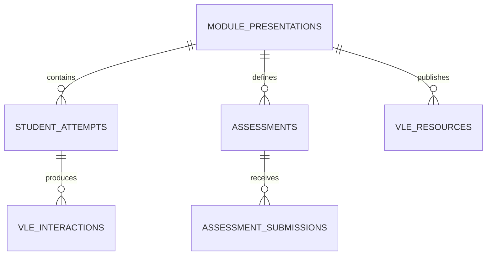

# SQL implementation

## Relational design and grains

| Relation | Grain |
| --- | --- |
| `core.module_presentations` | one module-presentation |
| `core.student_attempts` | one student-module-presentation attempt |
| `core.assessments` | one assessment |
| `core.assessment_submissions` | one submitted student-assessment pair |
| `core.vle_resources` | one site within a module-presentation |
| `core.vle_interactions` | source student-site-relative-day interaction row |
| `analytics.weekly_engagement` | one active student-attempt-course week |
| `analytics.assessment_progress` | one eligible student-assessment pair |
| `features.model_snapshots` | one student-attempt-course week with a next assessment |

`id_student` is not a row key by itself. A person can appear in multiple
modules or presentations. That distinction is enforced in the primary key and
in every attempt-level join.

## Ordered SQL

| File | Responsibility |
| --- | --- |
| `00_database.sql` | schemas and layer contracts |
| `01_raw_tables.sql` | source-faithful CSV landing tables |
| `02_staging.sql` | missing markers, names, and data types |
| `03_core.sql` | keys, constraints, normalized tables, fact indexes |
| `04_quality.sql` | executable quality framework |
| `05_analytics.sql` | engagement, assessment, withdrawal, and outcome marts |
| `06_features.sql` | availability registry and point-in-time snapshots |
| `07_indexes.sql` | analytical indexes and statistics |
| `08_exports.sql` | stable report-facing views |
| `09_performance.sql` | captured `EXPLAIN ANALYZE` plans |

## Techniques demonstrated

- multi-table joins at explicit grains;
- conditional aggregates with `FILTER`;
- `LAG` for prior-week activity;
- rolling fourteen-day and cumulative windows;
- `percent_rank` for cohort-relative activity;
- gap detection from prior activity dates;
- lateral joins for the next eligible assessment;
- generated student-week rows;
- materialized views with unique indexes;
- composite and covering indexes;
- explicit point-in-time predicates.

## Quality framework

`make validate` executes row-count, natural-key, relationship, category, score,
weight, date, missingness, code, snapshot-grain, target, and future-information
checks. Results persist in `quality.run_results`; warnings and informational
profiles remain visible rather than being silently treated as successful
tests.

## Query gallery

[sql/gallery/queries.sql](../sql/gallery/queries.sql) contains 15 complete
queries. [sql-query-gallery.md](sql-query-gallery.md) explains each analytical
question, technique, source, interpretation, and limitation.

## Performance

The large interaction table is used in two performance studies:

1. direct weekly aggregation from the 10.6 million-row fact table versus the
   indexed materialized weekly mart;
2. repeated student-week range construction versus a materialized snapshot
   scan.

`sql/09_performance.sql` saves the actual JSON plans in
`analytics.performance_runs`. See [performance.md](performance.md) for measured
results and tradeoffs. Timings are machine-specific and are never invented.
